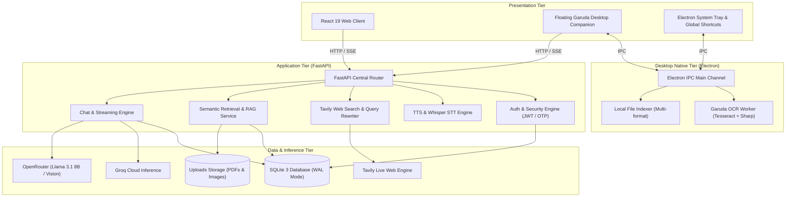
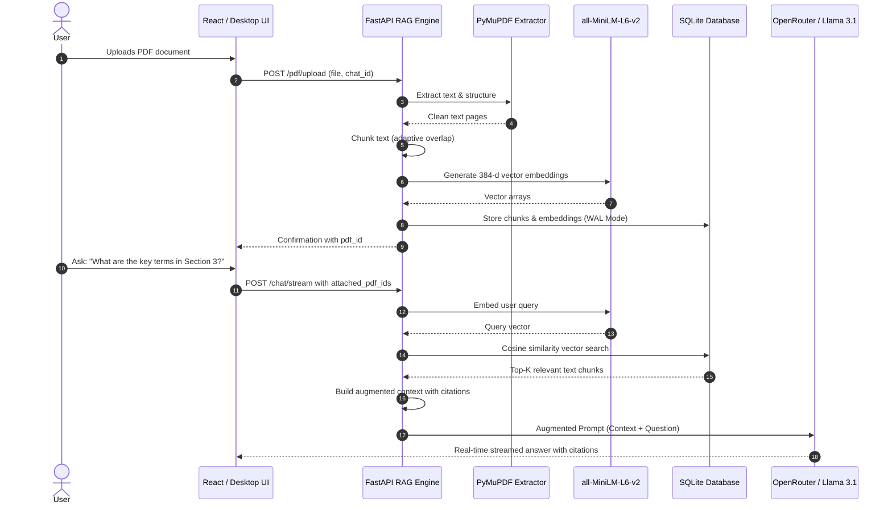
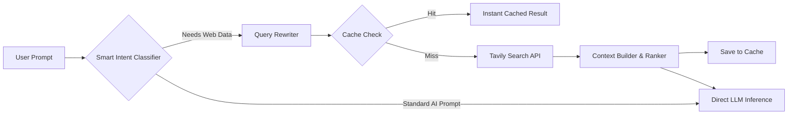
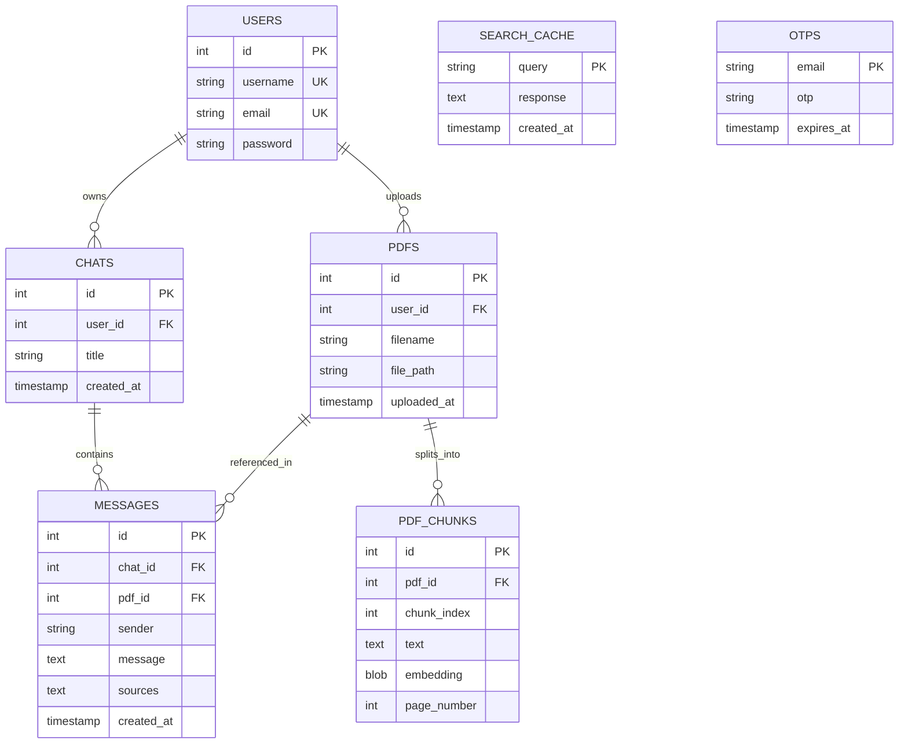

# 🦅 Garuda AI — Technical Overview & System Architecture

An in-depth technical exploration of the **Garuda AI** platform, detailing system architecture, data processing pipelines, RAG mechanisms, desktop automation, and security models.

---

## 📌 1. Executive Summary

**Garuda AI** is an intelligent, multimodal desktop and web companion designed to bridge the gap between cloud LLMs, real-time web intelligence, and local document/desktop workflows. 

While conventional AI interfaces remain confined to basic chat windows, Garuda AI operates as an integrated intelligence system featuring:
1. **Multi-Model Cloud LLM Gateway**: Dynamic routing across OpenRouter, Groq, and Gemini with intelligent fallback.
2. **Local-First RAG Pipeline**: High-speed document chunking, semantic vector search using `all-MiniLM-L6-v2`, and automated fact citation.
3. **Real-Time Web Retrieval**: Smart search routing with Tavily, query rewriting, and semantic caching.
4. **Desktop Intelligence (Floating Garuda)**: An Electron-based desktop assistant providing transparent overlay widgets, local filesystem indexing, and screen OCR.
5. **Memory-Conscious Architecture**: Designed to operate smoothly on resource-constrained deployments (such as Render's 512MB RAM tier) via lazy model loading and CPU-friendly embeddings.

---

## 🏗️ 2. Architectural Overview

Garuda AI adopts a modular client-server architecture consisting of three primary tiers:

---

## 🔍 3. Subsystem Deep Dives

### 3.1 Chat & Streaming Orchestration Engine
- **Endpoint**: `/chat/stream`, `/chat`, `/chat/regenerate`, `/chat/edit`
- **Context Window Management**:
  - Automatically bounds history to the last `12` messages (`MAX_HISTORY_MESSAGES`).
  - Caps single message inputs to `6,000` characters and total context to `24,000` characters to prevent context overflow and excessive latency.
- **Provider Fallback & Retries**:
  - Primary provider: **OpenRouter** (`meta-llama/llama-3.1-8b-instruct`).
  - Secondary fallback: **Groq** for high-throughput inference.
  - Implements exponential backoff with retry mechanisms on network drops or rate limits.
- **Streaming Protocol**:
  - Leverages FastAPI `StreamingResponse` with generator functions yielding text chunks in real-time, allowing instant perceptual response times for users.

---

### 3.2 RAG (Retrieval-Augmented Generation) & Document Intelligence
The document intelligence engine enables users to chat with complex PDFs and office documents with verifiable citations:

#### Key RAG Components:
- **PyMuPDF Extraction** (`app/services/pdf_service.py`): Extract clean text from multi-page PDFs with page numbers preserved.
- **Smart Chunking** (`app/services/pdf_chunker.py`): Splits documents into semantically coherent segments with overlapping boundaries to prevent contextual fragmentation.
- **Lazy Vector Embeddings** (`app/services/embedding_service.py`): Embeds chunks with `sentence-transformers/all-MiniLM-L6-v2`. The model is loaded lazily on the first request, maintaining a near-zero initial memory footprint.
- **Semantic Retriever** (`app/services/semantic_retriever.py`): Computes vector dot products and cosine similarity to rank chunks.
- **Document Comparison** (`app/services/compare_pdf_service.py`): Allows simultaneous multi-document comparison across contrasting viewpoints.
- **Citations Builder** (`app/services/citation_builder.py`): Emits structured source links `[Page X, Section Y]` that map to original documents.

---

### 3.3 Live Web Search Intelligence
When queries require real-time information or external knowledge beyond static documents, Garuda activates its web search pipeline:

- **Router AI** (`app/ai/router_ai.py`): Determines whether a prompt necessitates live web queries (e.g. current events, live stock data, sports scores, weather).
- **Query Rewriting** (`app/services/query_rewriter.py`): Reformulates conversational user prompts into optimal search keywords.
- **Response Caching** (`app/services/cache_service.py`): Avoids duplicate web queries by checking the `search_cache` table.

---

### 3.4 Vision & Multimodal Image Analysis
- **Supported Formats**: JPEG, PNG, WebP (enforced size cap: 5MB).
- **Storage**: Uploaded to `backend/uploads/images` with unique UUID identifiers.
- **Vision Pipeline**: Images are base64 encoded and attached to OpenRouter multimodal endpoints, allowing users to ask questions regarding screenshots, charts, diagrams, and photos.

---

### 3.5 Audio & Speech Pipeline
- **Text-to-Speech (TTS)** (`app/routes/tts.py`):
  - Converts AI responses into spoken audio using `pyttsx3` with temporary audio buffer streaming.
  - Automatically cleans up temporary WAV files after streaming completion using Starlette's `BackgroundTask`.
- **Speech-to-Text (STT)** (`app/routes/voice.py`):
  - Utilizes `faster-whisper` for local voice recognition.
  - Guarded by the `GARUDA_ENABLE_WHISPER` environment flag to prevent memory exhaustion on machines with <2GB RAM.

---

### 3.6 Desktop Companion (Electron & Floating Garuda)
The desktop version introduces capabilities impossible in a standard browser:

1. **Floating Garuda Assistant**:
   - Frameless, transparent, always-on-top window.
   - Quick command input with instant streaming response.
   - Expandable into full desktop workspace.
2. **Local File Intelligence**:
   - Indexes local files across 30+ extensions (`.pdf`, `.docx`, `.xlsx`, `.pptx`, `.txt`, `.py`, `.js`, etc.).
   - Builds an in-memory index of files within selected workspace directories.
   - Allows users to search and query their local drive without manual uploading.
3. **Background OCR Worker** (`garudaOcrWorker.cjs`):
   - Offloads optical character recognition to a dedicated Node.js background thread.
   - Uses `tesseract.js` and `sharp` to process screen captures and pasted images without blocking the main UI thread.
4. **Desktop System Integration**:
   - Custom URI protocol handler (`garuda://`).
   - System tray menu with status indicator and quick access.
   - Global keyboard shortcuts.

---

### 3.7 Authentication & Security Architecture
- **Password Protection**: Passwords hashed using `bcrypt` via `passlib`.
- **JWT Authorization**: Stateless, signed bearer tokens using `python-jose` with configurable expiry.
- **Password Reset with SMTP OTP**:
  - Generates secure 6-digit numeric OTPs stored with a 10-minute expiration window.
  - Dispatches automated notification emails via standard SMTP.
- **Input Sanitization**: File path traversal prevention (`../` checks) on image and document attachments.

---

## 🗄️ 4. Database Schema & Data Models

Garuda AI uses **SQLite 3** operating in **WAL (Write-Ahead Logging)** mode for concurrent read/write stability:

---

## ⚡ 5. Performance & Deployment Optimization

Garuda AI has been engineered specifically to minimize operational costs and run on resource-constrained environments:

1. **Zero-Overhead Startup**:
   - Heavy machine learning libraries (`sentence-transformers`, `torch`, `faster-whisper`) are NOT initialized upon application boot.
   - They are loaded lazily on the first request that specifically requires them.
2. **FastAPI Asynchronous Streaming**:
   - Chat responses start streaming immediately to the client, preventing HTTP request timeouts.
3. **Smart Context Truncation**:
   - Old message history is trimmed dynamically to maintain context limits and reduce prompt token costs.
4. **Local Search Caching**:
   - Frequent web search queries are cached in SQLite, reducing external Tavily API calls.

---

## 🗺️ 6. Future Roadmap

- [ ] **Multi-Vector Hybrid Search**: Combining BM25 keyword search with dense vector embeddings for hybrid retrieval.
- [ ] **Audio Duplex Streaming**: Full bi-directional voice conversation using WebSocket / WebRTC streams.
- [ ] **Plugin / Tool Ecosystem**: Sandboxed code execution engine (Python / JavaScript REPL) directly within chat.
- [ ] **Multi-User Collaboration**: Shared team workspaces and collaborative document annotation.
- [ ] **Native Mobile Companion**: Progressive Web App (PWA) and React Native mobile clients.

---

*Document Version: 1.0.0*  
*Last Updated: 2026*  
*Author: Neeruganti Santhosh*
