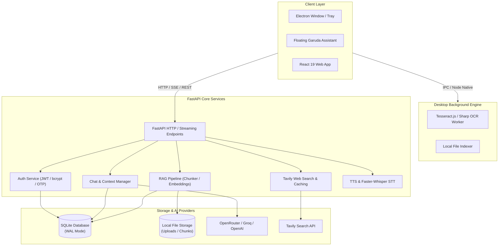

# 🦅 Garuda AI

<p align="center">
  
</p>

<p align="center">
  <strong>An Intelligent Desktop & Web AI Companion with Local File Intelligence, Multimodal Vision, Real-Time Web Search, and RAG Document Understanding.</strong>
</p>

<p align="center">
  <a href="https://github.com/santhoshneeruganti-ctrl/garuda-ai/blob/master/LICENSE"></a>
  
  
  
  
  
  
</p>

---

## 📖 Table of Contents

- [Overview](#-overview)
- [Key Features](#-key-features)
- [Architecture & Tech Stack](#-architecture--tech-stack)
- [Project Structure](#-project-structure)
- [Getting Started](#-getting-started)
  - [Prerequisites](#prerequisites)
  - [Backend Setup](#1-backend-setup)
  - [Frontend & Desktop Setup](#2-frontend--desktop-companion-setup)
  - [Environment Variables](#3-environment-configuration)
- [API Reference](#-api-reference)
- [Desktop Companion Features](#-desktop-companion-features)
- [Documentation](#-documentation)
- [License & Contact](#-license--contact)

---

## 🌟 Overview

**Garuda AI** is an end-to-end artificial intelligence suite designed to unify intelligent chat, document analytics, live internet research, vision analysis, and local desktop automation into a seamless experience. 

Built with **FastAPI** on the backend and **React 19 + Electron** on the frontend, Garuda provides both an intuitive web application and an omnipresent **Floating Garuda** desktop companion capable of indexing local files, processing documents with OCR, capturing screen contexts, and streaming AI responses with citations.

---

## 🚀 Key Features

### 🧠 Advanced AI & Streaming Responses
- **Multi-LLM Orchestration**: Native integration with OpenRouter, Groq, and Gemini models with intelligent fallback and retry policies.
- **Real-Time Streaming**: Low-latency token streaming for fluid multi-turn conversations via Server-Sent Events (SSE) / Streaming Responses.
- **Context-Aware Memory**: Multi-turn history management with smart conversation trimming and context optimization.

### 📄 Document Intelligence & Local RAG
- **Deep Document Parsing**: High-speed PDF text extraction and semantic chunking powered by `PyMuPDF`.
- **Vector Search & Semantic Retrieval**: Lazy-loaded `all-MiniLM-L6-v2` embeddings for zero startup overhead and low-memory deployments.
- **Smart Document Comparison**: Compare multiple uploaded documents side-by-side with structured contrast matrices.
- **Automated Summarization & Citations**: Automatic fact extraction and verifiable inline source citations.

### 🌐 Live Web Intelligence
- **Intelligent Web Search**: Powered by Tavily AI with query routing and intent classification.
- **Query Rewriting & Expansion**: Automatically reformulates complex prompts for higher-quality search results.
- **Search Response Caching**: In-memory and SQLite caching to eliminate duplicate searches and reduce API costs.

### 👁️ Multimodal Vision & OCR
- **Image Intelligence**: Multi-format image analysis (JPEG, PNG, WebP) with base64 serialization for vision models.
- **Background OCR Worker**: Built-in Tesseract.js and Sharp worker pipeline for instant text extraction from captured screen regions.

### 🎙️ Voice & Audio Suite
- **Text-to-Speech (TTS)**: Server-side audio synthesis using `pyttsx3` with direct audio streaming, complemented by browser speech synthesis.
- **Speech-to-Text (STT)**: Integration with `faster-whisper` with configurable on-demand loading to conserve RAM on free-tier cloud instances.

### 💻 Floating Garuda Desktop Companion
- **Always-on-Top Floating Widget**: Interactive, draggable widget with glassmorphism UI and fluid animations.
- **Local File System Indexing**: Deep-indexing of workspace documents (`.pdf`, `.docx`, `.xlsx`, `.pptx`, `.py`, `.js`, `.txt`, `.csv`, etc.) for immediate retrieval.
- **Desktop Automation**: Global system hotkeys, system tray support, and deep-link protocol (`garuda://`).

### 🔐 Security & Identity
- **JWT & Password Security**: Robust user authentication with `python-jose` and `bcrypt` password hashing.
- **OTP Verification**: Secure email-based OTP verification for account recovery and password resets via SMTP.

---

## 🛠️ Architecture & Tech Stack



### Technology Breakdown

| Component | Technology | Role |
| :--- | :--- | :--- |
| **Backend Framework** | [FastAPI](https://fastapi.tiangolo.com/) | Asynchronous API, streaming responses, routing |
| **Server Engine** | [Uvicorn](https://www.uvicorn.org/) | ASGI web server implementation |
| **Frontend Framework** | [React 19](https://react.dev/) + [Vite](https://vite.dev/) | Modern reactive user interface and build pipeline |
| **Desktop Framework** | [Electron](https://www.electronjs.org/) + [Electron Forge](https://www.electronforge.io/) | Native window management, IPC, system tray, file access |
| **Styling & Motion** | Vanilla CSS + [Framer Motion](https://www.framer.com/motion/) | Glassmorphism, animations, responsive dark UI |
| **Embeddings & Search** | `sentence-transformers` (`all-MiniLM-L6-v2`) | Local vector embeddings for semantic document retrieval |
| **Document Processing** | `PyMuPDF` (fitz) | Fast PDF text and structural parsing |
| **OCR Pipeline** | `tesseract.js` + `sharp` | Screen capture text recognition |
| **Database** | SQLite3 (WAL Mode) | Users, chats, messages, document vectors, search cache |
| **Search Engine** | [Tavily AI](https://tavily.com/) | Real-time web retrieval |
| **LLM Gateway** | [OpenRouter](https://openrouter.ai/) / [Groq](https://groq.com/) | Multi-provider LLM inference |

---

## 📁 Project Structure

```text
garuda/
├── .env.example                     # Environment template
├── LICENSE                          # Proprietary Software License
├── README.md                        # Primary project documentation
├── OVERVIEW.md                      # In-depth architectural & system overview
├── requirements.txt                 # Legacy / top-level dependencies
├── docs/
│   ├── architecture.md              # Deep-dive system architecture & flow diagrams
│   └── requirements.md              # Functional & non-functional requirements
├── backend/
│   ├── .env.example                 # Backend environment variable template
│   ├── requirements.txt             # Python backend dependencies
│   ├── garuda.db                    # SQLite primary database
│   ├── uploads/                     # Uploaded documents and images
│   └── app/
│       ├── main.py                  # FastAPI application entry point & CORS configuration
│       ├── ai/
│       │   ├── ai_handler.py        # LLM provider calls, fallbacks, and vision inference
│       │   └── router_ai.py         # Search & document intent classifier
│       ├── auth/
│       │   ├── jwt_handler.py       # JWT creation, verification, and decoding
│       │   └── mail_sender.py       # SMTP OTP email dispatcher
│       ├── database/
│       │   └── database.py          # SQLite schema, tables, migrations, and connections
│       ├── models/                  # Pydantic request/response schemas
│       ├── routes/                  # API route controllers (chat, pdf, image, auth, etc.)
│       └── services/                # Business logic (RAG, web search, voice, embeddings)
└── backend/frontend/
    ├── package.json                 # Node dependencies and scripts
    ├── vite.config.js               # Vite build configuration
    ├── electron.cjs                 # Electron main process (IPC, tray, indexing)
    ├── garudaOcrWorker.cjs          # Background OCR worker script
    ├── preload.cjs                  # Electron security preload script
    └── src/
        ├── App.jsx                  # Main application controller
        ├── components/
        │   ├── Header.jsx           # App top bar & navigation
        │   ├── Sidebar.jsx          # Chat history & session management
        │   ├── InputBar.jsx         # Multimodal input composer
        │   ├── ChatWindow.jsx       # Message stream & conversation renderer
        │   ├── CodeBlock.jsx        # Syntax-highlighted code with copy & download
        │   ├── SmartFolders.jsx     # Workspace folder and document browser
        │   └── desktop/
        │       ├── FloatingGaruda.jsx # Draggable floating desktop AI widget
        │       └── FloatingGaruda.css # Floating companion styling
        └── services/                # Client-side API and state services
```

---

## 🏁 Getting Started

### Prerequisites

Ensure you have the following installed on your machine:
- **Python**: Version `3.10` or higher
- **Node.js**: Version `18.x` or higher (LTS recommended)
- **npm**: Version `9.x` or higher
- **Git**

---

### 1. Backend Setup

1. **Navigate to the backend directory**:
   ```bash
   cd backend
   ```

2. **Create and activate a virtual environment**:
   ```bash
   # Windows (PowerShell)
   python -m venv venv
   .\venv\Scripts\Activate.ps1

   # Linux / macOS
   python3 -m venv venv
   source venv/bin/activate
   ```

3. **Install dependencies**:
   ```bash
   pip install -r requirements.txt
   ```

4. **Configure environment variables**:
   ```bash
   cp .env.example .env
   # Edit .env with your favorite editor and set your API keys
   ```

5. **Start the FastAPI server**:
   ```bash
   uvicorn app.main:app --reload --host 127.0.0.1 --port 8000
   ```
   The backend API will be available at [http://127.0.0.1:8000](http://127.0.0.1:8000).  
   Interactive Swagger documentation is at [http://127.0.0.1:8000/docs](http://127.0.0.1:8000/docs).

---

### 2. Frontend & Desktop Companion Setup

1. **Navigate to the frontend directory**:
   ```bash
   cd backend/frontend
   ```

2. **Install Node dependencies**:
   ```bash
   npm install
   ```

3. **Run in Web Development Mode (Browser)**:
   ```bash
   npm run dev
   ```
   Open [http://localhost:5173](http://localhost:5173) in your browser.

4. **Run as Desktop Application (Electron + Floating Garuda)**:
   ```bash
   npm run electron
   # Or using Electron Forge:
   npm start
   ```

5. **Package for Desktop Distribution**:
   ```bash
   npm run make
   ```
   Executables and installers will be generated in `backend/frontend/out/make/`.

---

### 3. Environment Configuration

Create a `.env` file in the `backend/` directory based on [`.env.example`](file:///.env.example):

```env
# ============================================================
# LLM Providers
# ============================================================
OPENROUTER_API_KEY=your_openrouter_api_key_here
OPENROUTER_MODEL=meta-llama/llama-3.1-8b-instruct

# Optional Fallback Providers
GROQ_API_KEY=your_groq_api_key_here
GEMINI_API_KEY=your_gemini_api_key_here

# ============================================================
# Web Search Intelligence
# ============================================================
TAVILY_API_KEY=your_tavily_api_key_here

# ============================================================
# SMTP Email & OTP Service
# ============================================================
EMAIL=your_email@gmail.com
EMAIL_PASSWORD=your_app_specific_password

# ============================================================
# Performance & Memory Optimization
# ============================================================
# Set to 'true' if running on a machine with >2GB RAM and you want local Whisper STT
GARUDA_ENABLE_WHISPER=false
```

---

## 📡 API Reference

A sample of primary endpoints exposed by the Garuda backend:

| Method | Endpoint | Description |
| :--- | :--- | :--- |
| `GET` | `/` | Health check and server status |
| `POST` | `/register` | Register a new user account |
| `POST` | `/login` | Authenticate user and issue JWT token |
| `POST` | `/forgot-password` | Generate and dispatch OTP email |
| `POST` | `/verify-otp` | Verify password reset OTP code |
| `POST` | `/reset-password` | Set new password with validated token |
| `GET` | `/profile` | Retrieve authenticated user profile |
| `POST` | `/chat` | Standard synchronous AI chat completion |
| `POST` | `/chat/stream` | Server-Sent Events (SSE) streaming chat |
| `POST` | `/chat/regenerate` | Regenerate last assistant response |
| `POST` | `/chat/edit` | Edit previous user message and re-stream |
| `POST` | `/new_chat` | Create a new conversation session |
| `GET` | `/get_chats` | List all conversation sessions for user |
| `GET` | `/get_messages/{chat_id}` | Retrieve full message history of a chat |
| `POST` | `/update_chat_title` | Rename chat conversation title |
| `POST` | `/delete_chat` | Delete conversation and associated data |
| `POST` | `/pdf/upload` | Upload and process PDF for RAG retrieval |
| `POST` | `/pdf-tools/summarize` | Generate structured executive summary of PDF |
| `POST` | `/image/upload` | Upload and validate image for vision reasoning |
| `POST` | `/voice/speak` | Text-to-Speech audio generation |
| `POST` | `/voice/transcribe` | Speech-to-Text audio transcription |

Full interactive API docs with schema validation are available at `/docs` when the backend is running.

---

## 🖥️ Desktop Companion Features

The **Floating Garuda** companion is accessible when running the Electron desktop build:

1. **Floating Garuda Assistant**:
   - Draggable, transparent overlay that sits on top of your workflow.
   - Quick prompt input bar with instant answers.
   - Voice trigger and one-click expand/collapse animations.

2. **Local Workspace Indexing**:
   - Monitors user-specified workspace folders.
   - Automatically builds an in-memory index of code, documents, spreadsheets, and presentations.
   - Instant search without cloud data leakage.

3. **Desktop OCR & Screen Reader**:
   - Capture any section of the screen and run OCR in the background.
   - Feed captured text directly into the AI context for analysis, explanation, or translation.

---

## 📚 Documentation

For deeper architectural details and specifications, refer to:
- [OVERVIEW.md](file:///c:/garuda/OVERVIEW.md) — Comprehensive technical overview and system design.
- [docs/architecture.md](file:///c:/garuda/docs/architecture.md) — Complete architecture diagrams, RAG pipeline flow, and data lifecycles.
- [docs/requirements.md](file:///c:/garuda/docs/requirements.md) — System requirements, API contracts, and specifications.

---

## 📄 License & Contact

**Copyright (c) 2026 Neeruganti Santhosh. All Rights Reserved.**

This software is distributed under a proprietary license. Unauthorized copying, modification, redistribution, or commercial use is strictly prohibited without prior written permission.  
Refer to the full [LICENSE](file:///c:/garuda/LICENSE) file for complete terms.

- **Author**: Neeruganti Santhosh
- **Email**: [santhoshneeruganti@gmail.com](mailto:santhoshneeruganti@gmail.com)
- **Repository**: [https://github.com/santhoshneeruganti-ctrl/garuda-ai](https://github.com/santhoshneeruganti-ctrl/garuda-ai)
