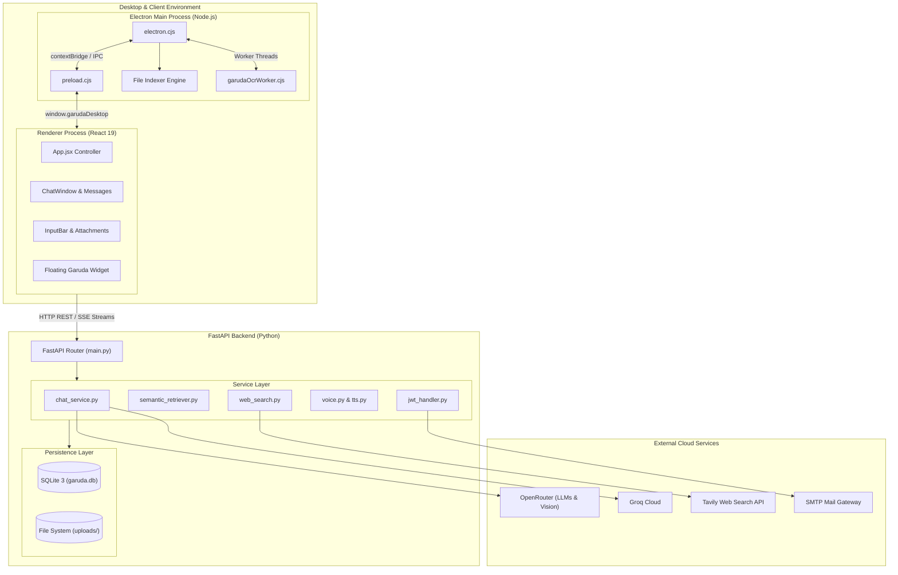
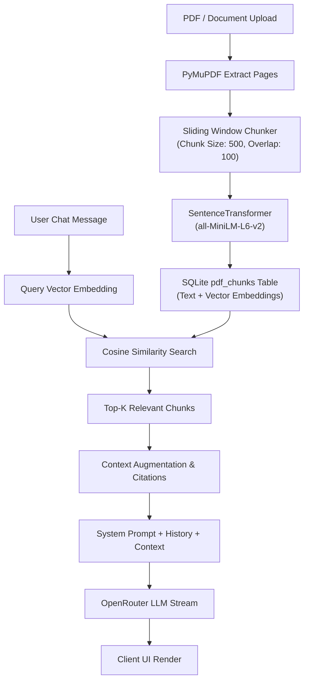
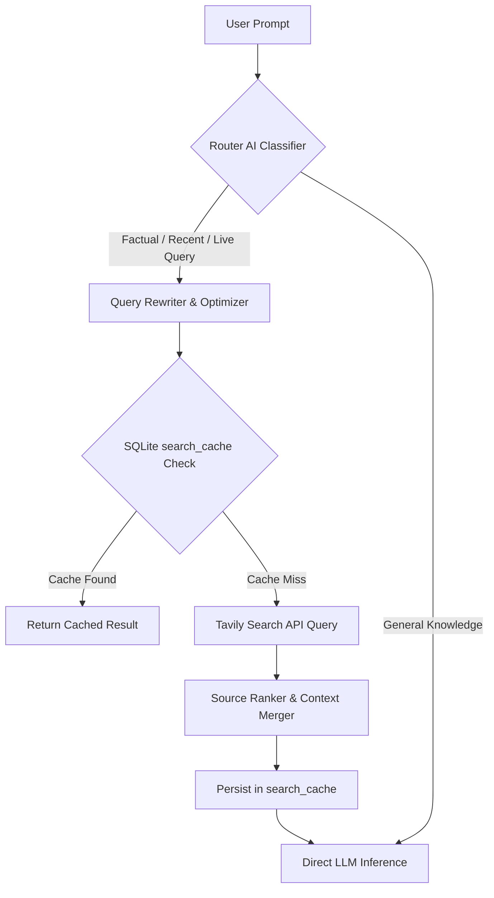

# 🏛️ Garuda AI — Architecture Specification

This document details the architectural principles, component interactions, module boundaries, data flows, and design patterns utilized across the Garuda AI application stack.

---

## 1. Architectural Philosophy

Garuda AI adheres to the following core design principles:

1. **Separation of Concerns**: Business logic is decoupled from HTTP presentation layers. FastAPI route controllers delegate processing to specialized service modules (`app/services/*`).
2. **Local-First Privacy & Efficiency**: Local files and indexing remain client-side within the Electron desktop environment unless explicitly attached for RAG analysis.
3. **Lazy-Resource Allocation**: Heavy ML models (embedding models, Whisper STT) are loaded on-demand to conserve system RAM on constrained cloud deployment tiers (e.g., Render free tier with 512MB RAM).
4. **Streaming by Default**: All generative LLM operations support real-time token streaming to eliminate perceptual wait times.

---

## 2. High-Level Component Topology



---

## 3. Communication Patterns

### 3.1 Client-to-Server Communication
- **Standard Requests**: JSON payloads over HTTP `POST`/`GET`.
- **Chat Streaming**: Server-Sent Events / chunked transfer encoding (`Transfer-Encoding: chunked`) via FastAPI `StreamingResponse`.
- **File Uploads**: `multipart/form-data` uploads for documents and image attachments with server-side size validation and MIME type checking.

### 3.2 Desktop IPC (Inter-Process Communication)
Electron isolates system-level access through strict Context Isolation:
- `preload.cjs` exposes safe, selective channels on `window.garudaDesktop`:
  - `minimizeWindow()`, `maximizeWindow()`, `closeWindow()`
  - `startOcr()`, `stopOcr()`
  - `scanLocalWorkspace()`, `searchLocalIndex()`
  - `toggleFloatingGaruda()`
- `garudaOcrWorker.cjs` operates as a decoupled child worker thread to prevent OCR computation from locking up the UI event loop.

---

## 4. Subsystem Pipelines

### 4.1 RAG (Retrieval-Augmented Generation) Pipeline



### 4.2 Web Search Routing & Caching Pipeline



---

## 5. Persistence & Storage Design

### 5.1 SQLite Configuration
- **Journal Mode**: `WAL` (Write-Ahead Logging) enables non-blocking concurrent reads during database write operations.
- **Connection Model**: Shared thread-safe connection with `check_same_thread=False` and per-operation cursors.
- **Foreign Key Constraints**: Enforced relational integrity between `users`, `chats`, `messages`, `pdfs`, and `pdf_chunks`.

### 5.2 Storage Hierarchy
```text
backend/
├── garuda.db                 # Primary relational database
└── uploads/
    ├── images/               # Validated image attachments (UUID filenames)
    └── [pdf_id].pdf          # Uploaded PDF documents
```

---

## 6. Security & Fault Tolerance

1. **Authentication**:
   - `bcrypt` hashing with salt rounds for passwords.
   - Stateless JWT tokens passed via HTTP `Authorization: Bearer <token>` headers.
   - Expiring OTP tokens for password recovery.
2. **File Validation**:
   - Strict extension and MIME validation for image uploads (`.jpg`, `.png`, `.webp`, size cap 5MB).
   - Sanitized paths prevents directory traversal attacks (`../` stripping).
3. **Resilience & Fallback**:
   - Multi-provider AI fallback: OpenRouter -> Groq -> OpenAI.
   - Graceful degradation: If Whisper STT is disabled, the system utilizes browser speech synthesis and recognition.

---

*Garuda AI Architectural Specification — Version 1.0.0*
